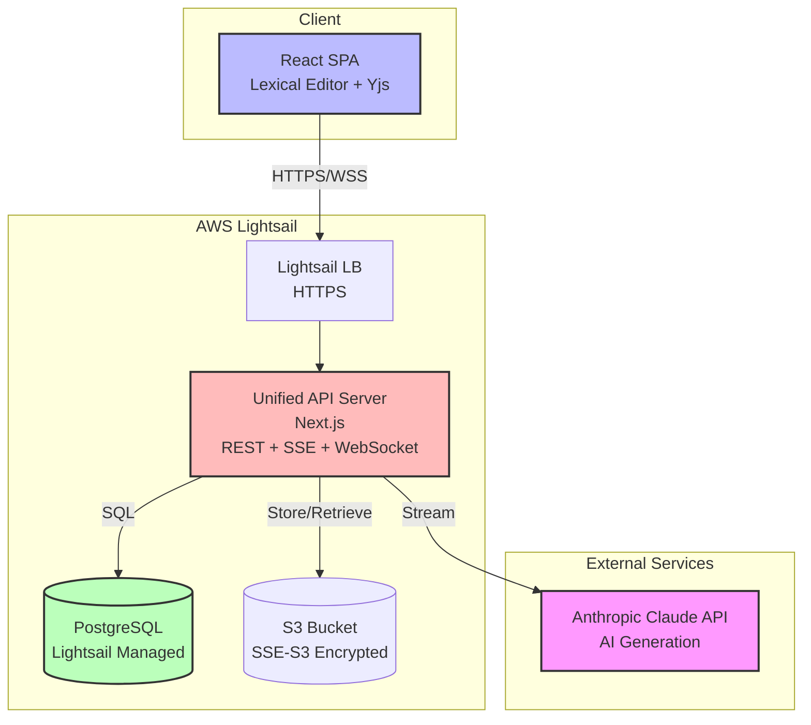

# Steno Demand Letter Generator - Full-Stack Architecture Document

## Introduction

This document outlines the complete fullstack architecture for the **Steno Demand Letter Generator**, including backend systems, frontend implementation, and their integration. It serves as the single source of truth for AI-driven development, ensuring consistency across the entire technology stack.

This unified approach combines what would traditionally be separate backend and frontend architecture documents, streamlining the development process for a modern fullstack application where these concerns are increasingly intertwined. The architecture prioritizes real-time collaboration, AI integration, security (critical for legal data), and scalability to support law firms of varying sizes.

### Starter Template or Existing Project

**N/A - Greenfield Project**

This is a new application being built from scratch. No existing starter templates or codebases are being used as a foundation.

### Change Log

| Date | Version | Description | Author |
|------|---------|-------------|--------|
| 2025-11-10 | 0.1 | Initial architecture document | Winston (Architect) |

---

## High Level Architecture

### Technical Summary

The Steno Demand Letter Generator follows a **simplified monolithic architecture** optimized for proof-of-concept deployment with minimal operational complexity. The frontend is a React 18+ single-page application (SPA) with TypeScript, featuring a rich text editor powered by Lexical and real-time synchronization via Yjs CRDTs. The backend is a single Node.js/TypeScript server using Next.js API Routes, providing RESTful endpoints, Server-Sent Events (SSE) for AI streaming, and WebSocket support for collaborative editing—all from one process. PostgreSQL serves as the database with Drizzle ORM, deployable as a simple Docker container or managed service. File storage uses AWS S3. The architecture prioritizes rapid development and ease of deployment over scalability, making it ideal for demonstrating all features with a small user base. AI integration via Vercel AI SDK enables streaming generation of demand letters with model flexibility (Claude/OpenAI/local). Authentication uses JWT tokens with basic role-based access control.

### Platform and Infrastructure Choice

**Platform:** AWS (Simplified Deployment)

**Recommended POC Deployment: AWS Lightsail**

**Key Services:**
- **Compute:** Lightsail container service (512MB-1GB RAM container)
- **Database:** Lightsail managed PostgreSQL (or container if preferred)
- **Storage:** S3 bucket with server-side encryption (SSE-S3)
- **Networking:** Lightsail load balancer with HTTPS
- **Secrets:** Environment variables in Lightsail console

**Deployment Host and Regions:**
- **Primary Region:** us-east-1 (US East - Virginia) - lowest cost
- **No DR/backup region for POC** - rely on automated Lightsail backups

**Monthly Cost Estimate:** ~$20-40 total
- Container: $10/month (512MB RAM)
- Database: $15/month (1GB RAM, 40GB storage)
- S3: ~$1-5/month (depending on document volume)

### Repository Structure

**Structure:** Monorepo

**Monorepo Tool:** npm workspaces (no Turborepo needed for POC)

**Package Organization:**

```
steno-demand-letters/
├── app/                        # Next.js App Router
│   ├── (auth)/
│   ├── projects/
│   ├── templates/
│   └── api/                    # API routes
├── components/                 # React components
│   ├── ui/                     # shadcn/ui components
│   └── features/               # Feature-specific components
├── lib/
│   ├── services/               # Business logic (AI, storage, etc.)
│   ├── db/                     # Drizzle schema and queries
│   └── utils/                  # Utilities
├── server.ts                   # Custom server for WebSockets
├── package.json
└── drizzle.config.ts
```

### High Level Architecture Diagram



### Architectural Patterns

- **Unified Server Architecture:** Single Node.js process handles REST, SSE, and WebSocket - *Rationale:* Eliminates deployment complexity, reduces operational overhead for POC, simplifies debugging

- **Component-Based UI (React):** Reusable React components with TypeScript and shadcn/ui (Radix + Tailwind) - *Rationale:* Rapid UI development with accessible primitives, matches PRD UI requirements

- **Monolithic Backend:** All modules (auth, documents, AI, templates, collaboration) in single codebase - *Rationale:* Fastest development velocity for POC, no distributed systems complexity

- **CRDT-Based Collaboration (Yjs):** Conflict-free replicated data types for real-time editing - *Rationale:* Enables Google Docs-style collaboration, proven technology, works well in single-server deployment

- **Repository Pattern (Light):** Drizzle Client provides data access abstraction - *Rationale:* Drizzle's generated client offers type safety without heavy repository layer overhead

- **Streaming Pattern (SSE for AI):** Server-Sent Events for real-time AI output - *Rationale:* Shows generation progress, simpler than WebSocket for unidirectional streaming

- **Firm-Level Isolation:** Row-level filtering via middleware - *Rationale:* Security requirement even for POC, prevents cross-firm data access

- **Basic Audit Logging:** Simple database table for document access events - *Rationale:* Demonstrates compliance capability without complex event sourcing infrastructure

---

## Tech Stack

This is the **definitive technology selection** for the entire project. All development must use these exact technologies and versions.

| Category | Technology | Version | Purpose | Rationale |
|----------|-----------|---------|---------|-----------|
| **Framework** | **Next.js** | **14+** | **Full-stack framework** | **Unified frontend/backend, excellent AI familiarity, simple deployment** |
| **Frontend Language** | TypeScript | 5.3+ | Type-safe JavaScript for React | Critical for reliability; excellent IDE support |
| **Build Tool** | Vite (via Next.js) | 5.0+ | Frontend build tooling | Fast, modern, well-documented |
| **UI Component Library** | shadcn/ui | Latest | Composable accessible components | WCAG compliant, Tailwind-based, copy-paste approach |
| **CSS Framework** | Tailwind CSS | 3.4+ | Utility-first styling | Rapid development, AI models know it well |
| **State Management** | Zustand | 4.4+ | Client state management | Simple, minimal boilerplate |
| **Server State** | TanStack Query | 5.0+ | Server state caching | Automatic caching, well-documented |
| **Rich Text Editor** | Lexical | 0.12+ | Collaborative editing | Modern, excellent Yjs integration |
| **Real-Time Collaboration** | Yjs | 13.6+ | CRDT library | Industry-leading CRDT, proven at scale |
| **WebSocket Sync** | y-websocket | 1.5+ | WebSocket provider for Yjs | Official Yjs connector |
| **Form Management** | React Hook Form | 7.48+ | Form validation | Minimal re-renders, Zod integration |
| **Validation** | Zod | 3.22+ | Schema validation (shared) | TypeScript-first, shared client/server |
| **HTTP Client** | Axios | 1.6+ | HTTP requests | Industry standard, well-known to AI models |
| **PDF Viewer** | react-pdf | 7.5+ | PDF rendering | Built on PDF.js, mobile-friendly |
| **Backend Language** | TypeScript (Node.js) | Node 20 LTS | Server runtime | Code sharing with frontend |
| **Backend Framework** | **Express** | **4.19+** | HTTP server | **Extremely well-documented, AI-familiar, massive ecosystem** |
| **Database** | PostgreSQL | 15+ | Primary database | ACID compliance, industry standard |
| **ORM** | **Drizzle ORM** | **0.29+** | Database ORM | **Lightweight, SQL-like, excellent TypeScript, better for AI coding** |
| **Authentication** | JWT (jsonwebtoken) | 9.0+ | Token auth | Stateless, well-understood pattern |
| **Password Hashing** | bcrypt | 5.1+ | Secure passwords | Industry standard |
| **File Storage** | **AWS S3** | **SDK v3** | Document storage with encryption | **Durable, cheap, SSE-S3 encryption, presigned URLs** |
| **Document Processing** | pdf-parse | 1.1+ | PDF extraction | Pure JavaScript, no dependencies |
| **Word Processing** | mammoth | 1.6+ | DOCX extraction | Lightweight, preserves formatting |
| **OCR** | Tesseract.js | 5.0+ | OCR for images | WebAssembly-based, free |
| **AI Integration** | **Vercel AI SDK** | **3.0+** | **Model-agnostic AI streaming** | **Supports Claude, OpenAI, local models; simpler than LangChain; excellent docs** |
| **WebSocket Server** | ws | 8.14+ | WebSocket implementation | Standard, integrates with Express |
| **Frontend Testing** | Vitest | 1.0+ | React unit tests | Fast, Vite-native |
| **Component Testing** | Testing Library | 14.0+ | Component testing | User-centric, accessible |
| **Backend Testing** | Jest | 29.7+ | Node.js testing | Industry standard, excellent mocking |
| **API Testing** | Supertest | 6.3+ | HTTP assertions | Essential for API testing |
| **E2E Testing** | Manual testing | N/A | Browser testing | **Manual testing sufficient for POC** |
| **Linting** | ESLint | 8.x | Code quality | Standard tool |
| **Code Formatting** | Prettier | 3.1+ | Code formatting | Consistent style |
| **Package Manager** | npm | 9+ (workspaces) | Monorepo management | Native workspace support |
| **Container Runtime** | Docker | 24+ | Containerization | Consistent environments |
| **Deployment Platform** | **AWS Lightsail** | N/A | **Hosting & managed PostgreSQL** | **Simplest AWS option, ~$20-40/month, managed DB, auto HTTPS** |
| **CI/CD** | GitHub Actions | N/A | Automated testing | Free, simple YAML |
| **Monitoring** | **CloudWatch + Sentry** | Latest | **Logging & error tracking** | **CloudWatch for logs, Sentry for errors** |
| **Logging** | Winston | 3.11+ | Structured logging | Well-known to AI models, flexible |
| **Environment Config** | dotenv | 16.3+ | Environment variables | Standard approach |

---

## Data Models

### Core Entity Overview

The system centers around **Projects** (demand letter cases), which contain **Source Documents** and generate **Drafts**. **Firms** provide multi-tenant isolation, while **Users** have roles (admin, attorney, paralegal) and belong to firms. **Templates** are firm-specific and define the structure for AI generation. **Draft Snapshots** enable version history, and **Comments** support collaboration.

### User

**Purpose:** Represents attorneys, paralegals, and administrators who use the system.

**TypeScript Interface:**
```typescript
export interface User {
  id: string;
  email: string;
  passwordHash: string;
  firstName: string;
  lastName: string;
  role: 'admin' | 'attorney' | 'paralegal';
  firmId: string;
  createdAt: Date;
  updatedAt: Date;
}
```

**Relationships:**
- Belongs to one `Firm`
- Has many `Projects` (as creator)
- Has many `Comments` (as author)

### Firm

**Purpose:** Represents a law firm. Provides multi-tenant data isolation.

**TypeScript Interface:**
```typescript
export interface Firm {
  id: string;
  name: string;
  createdAt: Date;
  updatedAt: Date;
}
```

### Project

**Purpose:** Represents a single demand letter case.

**TypeScript Interface:**
```typescript
export interface Project {
  id: string;
  title: string;
  clientName: string;
  status: 'draft' | 'in_review' | 'completed' | 'sent';
  caseDetails: Record<string, any>;
  templateId: string;
  firmId: string;
  createdBy: string;
  createdAt: Date;
  updatedAt: Date;
}
```

### SourceDocument

**Purpose:** Uploaded files (PDFs, images, Word docs) providing evidence.

**TypeScript Interface:**
```typescript
export interface SourceDocument {
  id: string;
  projectId: string;
  fileName: string;
  fileType: string;
  fileSize: number;
  s3Key: string;
  extractedText: string | null;
  extractionStatus: 'pending' | 'processing' | 'completed' | 'failed';
  uploadedBy: string;
  createdAt: Date;
}
```

### Template

**Purpose:** Defines structure and sections for demand letters.

**TypeScript Interface:**
```typescript
export interface Template {
  id: string;
  name: string;
  description: string;
  sections: TemplateSection[];
  variables: TemplateVariable[];
  firmId: string;
  version: number;
  createdBy: string;
  createdAt: Date;
  updatedAt: Date;
}
```

### Draft

**Purpose:** The generated demand letter content with real-time collaborative editing.

**TypeScript Interface:**
```typescript
export interface Draft {
  id: string;
  projectId: string;
  content: any; // Yjs Y.Doc encoded state
  plainText: string;
  currentVersion: number;
  createdAt: Date;
  updatedAt: Date;
}
```

### DraftSnapshot

**Purpose:** Version history for drafts.

**TypeScript Interface:**
```typescript
export interface DraftSnapshot {
  id: string;
  draftId: string;
  version: number;
  content: any;
  plainText: string;
  createdBy: string;
  changeDescription: string | null;
  createdAt: Date;
}
```

### Comment

**Purpose:** Inline comments for collaboration.

**TypeScript Interface:**
```typescript
export interface Comment {
  id: string;
  draftId: string;
  threadId: string;
  authorId: string;
  content: string;
  selectionStart: number;
  selectionEnd: number;
  resolved: boolean;
  createdAt: Date;
  updatedAt: Date;
}
```

---

## API Specification

The application uses **RESTful API** with JSON payloads, **Server-Sent Events (SSE)** for AI streaming, and **WebSocket** for real-time collaboration.

### Key Endpoints

**Authentication:**
- `POST /api/auth/register` - Register new user
- `POST /api/auth/login` - Authenticate and receive JWT tokens
- `POST /api/auth/refresh` - Refresh access token

**Projects:**
- `GET /api/projects` - List all projects (firm-filtered)
- `POST /api/projects` - Create new project
- `GET /api/projects/:id` - Get project details
- `PATCH /api/projects/:id` - Update project
- `DELETE /api/projects/:id` - Delete project

**Documents:**
- `POST /api/documents/upload` - Upload document to S3
- `GET /api/documents/:id` - Get document with presigned URL

**AI Generation:**
- `POST /api/ai/generate` - Generate draft (SSE streaming)
- `POST /api/ai/refine` - Refine section (SSE streaming)

**Templates:**
- `GET /api/templates` - List firm templates
- `POST /api/templates` - Create template
- `GET /api/templates/:id` - Get template
- `PUT /api/templates/:id` - Update template

**Drafts:**
- `GET /api/drafts/:id` - Get draft
- `GET /api/drafts/:id/versions` - List version history
- `POST /api/drafts/:id/versions/:version/restore` - Restore version
- `POST /api/drafts/:id/export` - Export to .docx

**Comments:**
- `GET /api/drafts/:id/comments` - List comments
- `POST /api/drafts/:id/comments` - Add comment
- `PATCH /api/comments/:id` - Update/resolve comment

**WebSocket:**
- `wss://[host]/collaboration?token={jwt}&room={draftId}` - Yjs collaboration

**Authentication:** All protected endpoints require `Authorization: Bearer {accessToken}` header.

---

## Components Architecture

### Frontend Components (Next.js)

**Pages:**
- `/app/(auth)/login` - Login page
- `/app/(auth)/signup` - Signup page
- `/app/projects` - Projects dashboard
- `/app/projects/[id]` - Project editor (collaborative)
- `/app/templates` - Template management

**Key Components:**
- `CollaborativeEditor` - Lexical + Yjs editor
- `DocumentUploader` - Drag-and-drop file upload
- `ProjectList` - Projects grid with filtering
- `AIGenerationView` - Streaming AI output display
- `TemplateBuilder` - Visual template creator
- `CommentSidebar` - Comment threads

### Backend Services (API Routes)

**Services:**
- `AuthService` - JWT generation, password hashing
- `ProjectService` - Project CRUD, firm isolation
- `DocumentService` - S3 upload, text extraction
- `AIService` - Prompt building, streaming generation
- `TemplateService` - Template CRUD
- `DraftService` - Version management
- `ExportService` - DOCX generation

**Structure:**
```
lib/services/
├── auth.service.ts
├── project.service.ts
├── storage.service.ts
├── extraction.service.ts
├── ai.service.ts
└── export.service.ts
```

---

## Project Structure

```
steno-demand-letters/
├── app/
│   ├── (auth)/
│   │   ├── login/page.tsx
│   │   └── signup/page.tsx
│   ├── (dashboard)/
│   │   ├── layout.tsx
│   │   ├── projects/
│   │   │   ├── page.tsx
│   │   │   └── [id]/page.tsx
│   │   └── templates/page.tsx
│   └── api/
│       ├── auth/
│       ├── projects/
│       ├── documents/
│       ├── ai/
│       ├── templates/
│       ├── drafts/
│       └── comments/
├── components/
│   ├── ui/              # shadcn/ui components
│   ├── auth/
│   ├── projects/
│   ├── editor/
│   ├── documents/
│   └── templates/
├── lib/
│   ├── services/        # Business logic
│   ├── db/
│   │   ├── schema.ts    # Drizzle schema
│   │   ├── client.ts
│   │   └── queries/
│   ├── hooks/
│   │   └── queries/     # React Query hooks
│   ├── stores/          # Zustand stores
│   ├── middleware/
│   │   └── auth.ts
│   └── utils/
├── server.ts            # Custom server for WebSocket
├── middleware.ts        # Next.js middleware (route protection)
├── drizzle.config.ts
├── .env.example
└── package.json
```

---

## Development Workflow

### Local Setup

```bash
# Install dependencies
npm install

# Set up environment
cp .env.example .env

# Run database migrations
npx drizzle-kit push:pg

# Start dev server (includes WebSocket)
npm run dev
```

### Environment Variables

```bash
# .env
DATABASE_URL=postgresql://localhost:5432/steno
JWT_SECRET=your-secret-key-change-in-production
JWT_REFRESH_SECRET=your-refresh-secret-change-in-production
ANTHROPIC_API_KEY=your-anthropic-key
AWS_ACCESS_KEY_ID=your-aws-key
AWS_SECRET_ACCESS_KEY=your-aws-secret
S3_BUCKET_NAME=steno-documents
AWS_REGION=us-east-1
NEXT_PUBLIC_WS_URL=ws://localhost:3000
```

### Development Commands

```bash
npm run dev          # Start development server
npm run build        # Build for production
npm run start        # Start production server
npm run test         # Run tests
npm run lint         # Lint code
npx drizzle-kit studio  # Database GUI
```

---

## Deployment Architecture

### AWS Lightsail Deployment

**1. Dockerfile:**
```dockerfile
FROM node:20-alpine
WORKDIR /app
COPY package*.json ./
RUN npm ci --only=production
COPY . .
RUN npm run build
EXPOSE 3000
CMD ["npm", "start"]
```

**2. Lightsail Setup:**
- Create container service (1GB RAM, $10/month)
- Create managed PostgreSQL database ($15/month)
- Create S3 bucket in us-east-1
- Configure environment variables in Lightsail console
- Set up custom domain with HTTPS (automatic)

**3. GitHub Actions CI/CD:**
```yaml
name: Deploy to AWS Lightsail
on:
  push:
    branches: [main]
jobs:
  deploy:
    runs-on: ubuntu-latest
    steps:
      - uses: actions/checkout@v3
      - run: npm ci
      - run: npm run test
      - run: npm run build
      - run: docker build -t steno .
      - run: aws lightsail push-container-image ...
```

---

## Security & Performance

### Security

**Authentication:**
- JWT access tokens: 15 minute expiry
- JWT refresh tokens: 7 day expiry
- bcrypt password hashing (cost factor 10)

**Data Protection:**
- Firm-level isolation enforced at middleware layer
- All database queries filtered by `firmId`
- S3 SSE-S3 encryption for documents
- Presigned URLs (1 hour expiry) for document access

**Input Validation:**
- Zod schemas on all API routes
- XSS prevention via React's default escaping
- SQL injection prevention via Drizzle parameterized queries

**CORS:**
- Whitelist production domain only
- No wildcard origins in production

### Performance

**Frontend:**
- Server Components for initial page load (no JS shipped)
- React Query caching (5 minute stale time)
- Next.js automatic code splitting
- Image optimization via Next.js Image component

**Backend:**
- Database indexes on `firmId`, `projectId`, foreign keys
- Connection pooling (Drizzle default)
- Presigned URLs (avoid proxying large files)

**Monitoring:**
- CloudWatch logs (AWS Lightsail automatic)
- Sentry for error tracking
- Winston for structured JSON logging

---

## Testing Strategy

### Backend Testing (Jest + Supertest)

**Priority:** API route tests, service layer tests

```typescript
// lib/services/__tests__/project.service.test.ts
import { projectService } from '../project.service';

describe('ProjectService', () => {
  it('creates project with draft', async () => {
    const project = await projectService.createProject({
      title: 'Test Case',
      clientName: 'John Doe',
      templateId: 'uuid',
      caseDetails: {},
      firmId: 'firm-uuid',
      createdBy: 'user-uuid'
    });
    expect(project.draft).toBeDefined();
  });
});
```

### Frontend Testing (Vitest + Testing Library)

**Priority:** Component unit tests for critical UI

```typescript
// components/projects/__tests__/ProjectList.test.tsx
import { render, screen } from '@testing-library/react';
import { ProjectList } from '../ProjectList';

test('renders projects', () => {
  render(<ProjectList initialProjects={mockProjects} />);
  expect(screen.getByText('Project 1')).toBeInTheDocument();
});
```

### E2E Testing

**For POC:** Manual testing sufficient. Playwright tests can be added later.

**Coverage Goals:**
- Backend API tests: 70%+ critical paths
- Frontend unit tests: Key components only
- E2E: Manual for POC

---

## Coding Standards

### Critical Rules

**Firm Isolation (Security):**
- ALWAYS filter database queries by `firmId`
- Use middleware to inject `firmId` from JWT
- Return 404 (not 403) for cross-firm access attempts

**TypeScript:**
- Strict mode enabled
- No `any` types (use `unknown` if necessary)
- All API responses properly typed

**Validation:**
- All API routes validate input with Zod
- Share schemas between frontend and backend
- Client-side validation for UX, server-side for security

**Error Handling:**
- All API routes wrapped in try/catch
- Return consistent error format
- Never expose internal errors to client

**Component Boundaries:**
- Mark client components with `'use client'`
- Server Components by default
- Use Server Components for data fetching

### Naming Conventions

| Element | Convention | Example |
|---------|-----------|---------|
| Components | PascalCase | `ProjectList.tsx` |
| Hooks | camelCase with `use` | `useProjects.ts` |
| Services | camelCase with `.service` | `auth.service.ts` |
| API Routes | kebab-case | `/api/projects/route.ts` |
| Database Tables | snake_case | `source_documents` |

---

## Error Handling

### Standard Error Format

```typescript
{
  error: {
    code: "VALIDATION_ERROR" | "UNAUTHORIZED" | "NOT_FOUND" | "INTERNAL_ERROR",
    message: "Human-readable error message",
    details: { /* Optional field-specific details */ },
    timestamp: "2025-11-10T12:00:00Z",
    requestId: "uuid"
  }
}
```

### API Route Error Handling Pattern

```typescript
// app/api/projects/route.ts
export async function POST(req: NextRequest) {
  try {
    const user = await requireAuth(req);
    const body = await req.json();
    const data = createProjectSchema.parse(body);

    const project = await projectService.createProject({
      ...data,
      firmId: user.firmId,
      createdBy: user.userId,
    });

    return NextResponse.json({ project }, { status: 201 });
  } catch (error) {
    if (error instanceof z.ZodError) {
      return NextResponse.json({
        error: {
          code: 'VALIDATION_ERROR',
          message: 'Invalid input',
          details: error.errors,
          timestamp: new Date().toISOString(),
        }
      }, { status: 400 });
    }

    if (error instanceof UnauthorizedError) {
      return NextResponse.json({
        error: {
          code: 'UNAUTHORIZED',
          message: error.message,
          timestamp: new Date().toISOString(),
        }
      }, { status: 401 });
    }

    console.error('Unexpected error:', error);
    return NextResponse.json({
      error: {
        code: 'INTERNAL_ERROR',
        message: 'An unexpected error occurred',
        timestamp: new Date().toISOString(),
      }
    }, { status: 500 });
  }
}
```

---

## Monitoring & Observability

### For POC

**Error Tracking:**
- Sentry for frontend and backend errors
- Free tier sufficient for POC

**Logging:**
- Winston for structured JSON logs
- CloudWatch Logs (automatic via Lightsail)
- Log levels: error, warn, info, debug

**Key Metrics to Track:**
- API response times
- AI generation token usage (cost monitoring)
- WebSocket connection count
- Database query performance
- S3 storage usage

**Log Format:**
```json
{
  "level": "info",
  "timestamp": "2025-11-10T12:00:00Z",
  "requestId": "uuid",
  "userId": "uuid",
  "firmId": "uuid",
  "action": "project.create",
  "duration": 150,
  "message": "Project created successfully"
}
```

---

## Architecture Summary

### Key Design Decisions

1. **Next.js App Router** - Single codebase for frontend + backend API routes
2. **Drizzle ORM** - Lightweight, SQL-like syntax, excellent for AI-assisted development
3. **Vercel AI SDK** - Model-agnostic AI integration (Claude/OpenAI/local)
4. **Yjs + Lexical** - Real-time collaboration with CRDT conflict resolution
5. **AWS Lightsail** - Simplified deployment (~$25/month for POC)
6. **Firm Isolation** - Multi-tenant security enforced at application and data layers
7. **Custom Server** - WebSocket support for Yjs within Next.js application

### Technology Highlights

- **TypeScript throughout** - Full type safety from database to UI
- **Zod validation** - Shared schemas between client and server
- **React Query** - Automatic server state caching and synchronization
- **Zustand** - Simple client state management
- **JWT authentication** - Stateless auth with token refresh pattern
- **S3 presigned URLs** - Secure, time-limited document access

### Ready for Implementation

This architecture supports all PRD requirements while optimizing for:
- **POC development speed** - Simplified stack, well-documented technologies
- **AI-assisted development** - Technologies familiar to AI coding models
- **Security** - Firm isolation, encryption, proper authentication
- **Scalability path** - Can migrate to full AWS infrastructure if POC succeeds

**Next Steps:** Begin implementation with Epic 1 (Foundation & Core Infrastructure) from the PRD.
